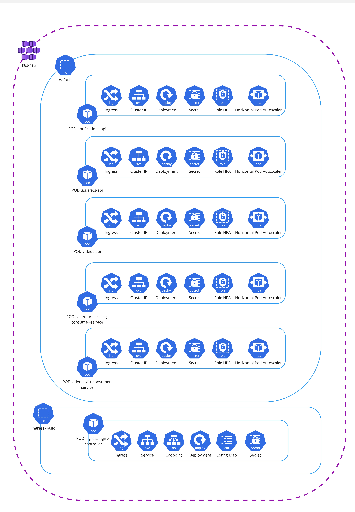

# Hackathon - Video Splitter Consumer Service

## Descrição

Microsserviço Quarkus que consome eventos Kafka de vídeos enviados, busca o arquivo original no Azure Blob Storage, divide o vídeo em segmentos via FFmpeg e persiste os chunks no Azure Blob. A cada chunk gerado, publica eventos Kafka de "vídeo fatiado" e em caso de erro envia o status.

## Funcionalidades

- **Consumidor Kafka**: Processa mensagens do canal `video-uploaded`.
- **Download do vídeo original**: Busca o arquivo original no Azure Blob (`AzureBlobVideoStorageFetcher`).
- **Split com FFmpeg**: Segmenta o vídeo em partes de N segundos (`SplitVideoUseCaseImpl`).
- **Persistência de chunks**: Grava cada chunk no Azure Blob (`AzureBlobVideoStoragePersister`).
- **Publicação de eventos**: Emite mensagens nos tópicos de split e status via canal `video-events`.
- **Health checks**: Expostos via SmallRye Health (readiness/liveness).

## Stack Tecnológica

- **Java 21**
- **Quarkus 3.25.4**
- SmallRye Reactive Messaging Kafka
- Azure Storage Blob SDK
- Lombok, ModelMapper
- Maven, Docker, Kubernetes

## Arquitetura


Considerando Clean Architecture:
- **Presentation/Infrastructure**: `presentation/kafka` (consumo) e `infrastructure` (Kafka producers, Azure Blob).
- **Application**: casos de uso, mapeadores e gateways (`application/*`).
- **Domain**: entidades de domínio (`domain/*`).

## Estruturação das pastas
```
src/main/java/br/com/video/splitter/
├── presentation/kafka/...           # Consumer: `VideoSplitterConsumerImpl` (@Incoming "video-uploaded")
├── application/...                  # Use cases e orquestração (`SplitVideoUseCaseImpl`, mappers, gateways)
├── infrastructure/azure/...         # Azure Blob fetcher/persister
├── infrastructure/kafka/...         # Producers: `KafkaVideoSplittedProducer`, `KafkaVideoStatusProducer`
└── domain/...                       # `VideoInfo`, `VideoChunkInfo`
```

## Variáveis de Ambiente / Secrets

Kafka e configuração da aplicação (ver `kubernetes/Deployment.yaml` e `docker-compose.yml`):
- `KAFKA_BOOTSTRAP_SERVERS`
- `KAFKA_SECURITY_PROTOCOL`
- `KAFKA_SASL_MECHANISM`
- `KAFKA_SASL_JAAS_CONFIG`
- `VIDEO_UPLOADED_TOPIC` (tópico de entrada)
- `VIDEO_SPLITTED_TOPIC` (tópico de saída: chunks)
- `VIDEO_STATUS_TOPIC` (tópico de saída: status)
- `VIDEO_EVENTS_DEFAULT_TOPIC` (default para canal `video-events`)
- `SEGMENT_TIME` (tempo do segmento em segundos; mapeia `segment.time`)
- `VIDEO_SPLIT_CONSUMER_CONCURRENCY`
- `AZURE_STORAGE_CONNECTION_STRING`

No Kubernetes usamos `kubernetes/Secret.yaml` (chaves em `stringData`). Localmente (Docker Compose) usamos `.env`.

## Dependência: FFmpeg

A divisão de vídeo usa o binário `ffmpeg`.
- No container Docker, o FFmpeg é instalado no `Dockerfile`.
- Localmente, instale e garanta no PATH, ou configure `ffmpeg.binary` via variável `FFMPEG_BINARY`.

Validação rápida:
- Local: `ffmpeg -version`
- Container: `docker compose exec app ffmpeg -version`

## Execução Local (Docker Compose)

`docker-compose.yml` inclui:
```yaml
env_file:
  - .env
```
Passos:
```bash
# 1) Criar/atualizar .env (manual ou via scripts em scripts/)
# 2) Build Maven (gera target/quarkus-app)
mvn -DskipTests package
# 3) Subir serviços
docker compose up -d --build
# 4) Logs da aplicação
docker compose logs -f app
```

## Execução Local (sem Docker)

```bash
mvn package
java -jar target/quarkus-app/quarkus-run.jar
```

## Tópicos e Canais Kafka

- **Canal de entrada**: `@Incoming("video-uploaded")`
  - Tópico configurado por `VIDEO_UPLOADED_TOPIC`.
- **Canal de saída**: `@Channel("video-events")`
  - `video.topic.split` → tópico para eventos de chunks (`KafkaVideoSplittedProducer`).
  - `video.topic.status` → tópico para eventos de status (`KafkaVideoStatusProducer`).

## Health Endpoints

- Readiness: `/video-splitter/health/ready`
- Liveness: `/video-splitter/health/live`

## Scripts auxiliares

1. `scripts/env-from-secret.ps1`: Secret.yaml → `.env`
   ```powershell
   powershell -ExecutionPolicy Bypass -File scripts/env-from-secret.ps1 -SecretPath kubernetes/Secret.yaml -OutFile .env
   ```
2. `scripts/secret-from-env.ps1`: `.env` → Secret.yaml
   ```powershell
   powershell -ExecutionPolicy Bypass -File scripts/secret-from-env.ps1 -EnvPath .env -SecretPath kubernetes/Secret.yaml
   ```

## Cobertura Sonar


## Arquitetura Infraestrutura

### Diagrama de Fluxo

- Dentro do Resource Group techchallenge-rg, há um IP Público que acessa o APIM (Azure API Management)
- Quando acessado e havendo configuração de suas políticas realiza a chamada para a function.
- O Ingress Controller então roteia as requisições para os diferentes serviços internos a depender da URI chamada, utilizando a comunicação via Cluster IP.
- As aplicações java se comunicam com seus respectivos databases utilizando a comunicação via Cluster IP.
  Obs: Para saber mais sobre o recurso Standard_B2S: https://learn.microsoft.com/pt-br/azure/virtual-machines/sizes/general-purpose/bv1-series?tabs=sizebasic

### Diagrama de Componente

O cluster k8s-fiap é configurado com dois namespaces principais, cada um com funções específicas:
- default: Namespace onde as aplicações principais são implantadas e gerenciadas, contendo os PODs:
    - video-splitter-consumer-service: aplicação presente no cluster.
        - Ingress: Configurado para gerenciar o tráfego de entrada direcionado à aplicação Java.
        - Cluster IP: Endereço IP interno para comunicação dentro do cluster.
        - Deployment: Gerencia a implantação e a escalabilidade da aplicação Java.
        - Secret: Armazena dados sensíveis, como chaves de API ou credenciais usadas pela aplicação.
        - Horizontal Pod Autoscaler (HPA): Configurado para escalar automaticamente o número de réplicas do pod com base na utilização de CPU.
        - Configuração do HPA:
            - Mínimo de 1 e máximo de 3 réplicas.
            - Escala a partir da métrica de uso de CPU atingir 70%.
        - Role HPA: Define as permissões necessárias para que o HPA acesse métricas do cluster (como CPU e memória) para tomar decisões de escalabilidade.
- ingress-basic: é responsável por gerenciar o tráfego externo e rotear as requisições para os serviços no namespace default.
    - ingress-nginx-controller: Executa o controlador NGINX Ingress, que atua como ponto de entrada para requisições externas e roteia o tráfego para os serviços apropriados no namespace default.
        - Ingress: Define as regras de roteamento para requisições externas (por exemplo, rotear requisições para o serviço do java-app).
        - Service: Expõe o controlador NGINX internamente no cluster.
        - Endpoint: Mapeia os endpoints para os serviços internos.
        - Deployment: Gerencia a implantação do controlador NGINX.
        - ConfigMap: Armazena configurações do NGINX, como limites de requisições, timeouts e outras opções de personalização.
        - Secret: Armazena informações sensíveis, como certificados TLS para habilitar HTTPS.    
          *Os arquivos de configuração do Kubernetes (em formato .yml) estão organizados no diretório kubernetes/, que contém os recursos descritos no diagrama.
